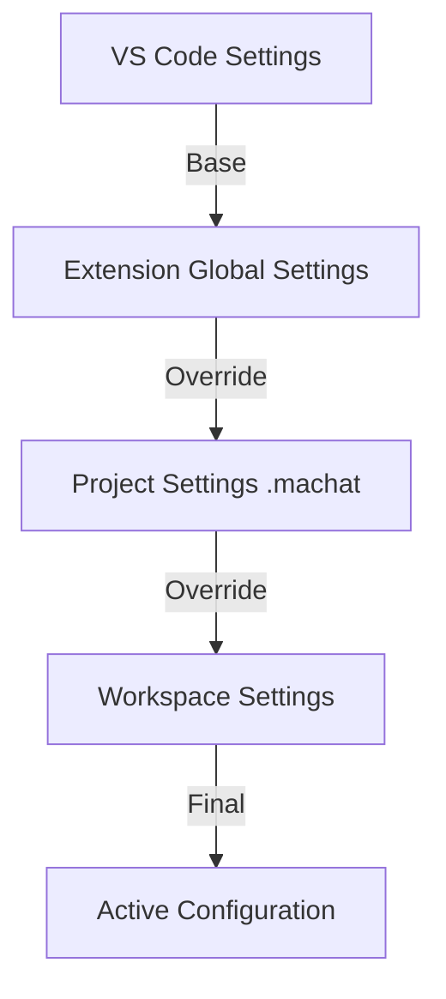

# Per-Project Settings Architecture Proposal
**Created:** 2025-01-18
**Author:** Multi Agent Chat Extension Team
**Status:** Proposed

## Executive Summary

Transform Multi Agent Chat from a global-only configuration to a hierarchical settings system that supports project-specific configurations, enabling teams to share agent setups and maintain project-specific context.

## Problem Statement

Currently:
- All settings are global to the VS Code installation
- Conversations are stored globally, mixing different projects
- No way to share agent configurations with team members
- Project context is lost when switching between projects
- Can't version control settings with the project

## Proposed Solution

### Directory Structure
```
project-root/
├── .machat/                        # Multi Agent Chat project folder
│   ├── config.json                 # Project settings overrides
│   ├── conversations/              # Project-specific conversation history
│   │   ├── 2025-01-18_xxx.json    # Individual conversations
│   │   └── index.json             # Conversation index
│   ├── agents/                     # Custom agent configurations
│   │   ├── custom-agents.json     # Project-specific agents
│   │   └── agent-prompts/         # Custom system prompts
│   │       ├── executor.md
│   │       └── architect.md
│   ├── context/                    # Project context and memory
│   │   ├── agent-memory.json      # Per-agent conversation context
│   │   ├── project-context.md     # Project documentation for agents
│   │   └── knowledge-base/        # Project-specific knowledge
│   └── .gitignore                  # Exclude sensitive data
```

### Settings Hierarchy



#### 1. VS Code Settings (Lowest Priority)
```json
{
  "claudeCodeChat.apiKey": "sk-ant-...",
  "claudeCodeChat.defaultModel": "sonnet"
}
```

#### 2. Extension Global Settings
```json
{
  "apiKeys": {
    "claude": "sk-ant-...",
    "openai": "sk-..."
  },
  "globalOptions": {
    "yoloMode": false,
    "defaultPermission": "ask"
  }
}
```

#### 3. Project Settings (.machat/config.json)
```json
{
  "projectName": "My Awesome Project",
  "agents": {
    "executor": {
      "model": "opus",
      "permissions": {
        "fileWrite": true,
        "commandExecution": true
      },
      "customPrompt": "./agents/agent-prompts/executor.md"
    }
  },
  "features": {
    "autoLoadContext": true,
    "shareConversations": false
  },
  "context": {
    "includeFiles": ["README.md", "ARCHITECTURE.md"],
    "excludePatterns": ["**/node_modules/**", "**/.git/**"]
  }
}
```

#### 4. Workspace Settings (.vscode/settings.json)
```json
{
  "machat.activeAgents": ["executor", "architect"],
  "machat.defaultAgent": "executor"
}
```

## Implementation Plan

### Phase 1: Settings Infrastructure (Week 1)
```typescript
class SettingsManager {
  private globalSettings: Settings;
  private projectSettings?: Settings;
  private workspaceSettings?: Settings;

  async loadSettings(projectPath: string): Promise<Settings> {
    // 1. Load VS Code settings
    const vscodeSettings = this.loadVSCodeSettings();

    // 2. Load global extension settings
    this.globalSettings = await this.loadGlobalSettings();

    // 3. Check for .machat/config.json
    const machatPath = path.join(projectPath, '.machat', 'config.json');
    if (await fs.exists(machatPath)) {
      this.projectSettings = await this.loadProjectSettings(machatPath);
    }

    // 4. Load workspace settings
    this.workspaceSettings = this.loadWorkspaceSettings();

    // 5. Merge with precedence
    return this.mergeSettings(
      vscodeSettings,
      this.globalSettings,
      this.projectSettings,
      this.workspaceSettings
    );
  }
}
```

### Phase 2: Conversation Migration (Week 2)
```typescript
class ConversationManager {
  async getConversationPath(projectPath?: string): Promise<string> {
    if (projectPath) {
      // Use project-specific location
      const projectConvPath = path.join(projectPath, '.machat', 'conversations');
      await this.ensureDirectory(projectConvPath);
      return projectConvPath;
    }

    // Fallback to global location
    return this.getGlobalConversationPath();
  }

  async migrateConversations(from: string, to: string): Promise<void> {
    // Move existing conversations to new location
    // Update index
    // Preserve metadata
  }
}
```

### Phase 3: Context Management (Week 3)
```typescript
class ProjectContextManager {
  async loadProjectContext(projectPath: string): Promise<ProjectContext> {
    const contextPath = path.join(projectPath, '.machat', 'context');

    return {
      agentMemory: await this.loadAgentMemory(contextPath),
      projectDocs: await this.loadProjectDocs(contextPath),
      knowledgeBase: await this.loadKnowledgeBase(contextPath)
    };
  }

  async includeInAgentPrompt(agent: string): Promise<string> {
    const context = await this.loadProjectContext(this.projectPath);
    return this.formatContextForAgent(agent, context);
  }
}
```

## Benefits

### For Individual Developers
- **Project Isolation**: Different settings for different projects
- **Context Preservation**: Project knowledge stays with project
- **Easy Switching**: Change projects without losing context

### For Teams
- **Shared Configuration**: Team members use same agent setups
- **Knowledge Sharing**: Shared context and documentation
- **Onboarding**: New developers get configured agents immediately

### For Open Source
- **Reproducible Setups**: Include .machat in repo
- **Community Agents**: Share custom agent configurations
- **Documentation Integration**: Agents aware of project docs

## Migration Strategy

### Backward Compatibility
1. If no .machat folder exists, use global settings
2. Provide migration command to create .machat from current settings
3. Keep global settings as fallback

### Migration Command
```typescript
async function migrateToProjectSettings(): Promise<void> {
  // 1. Create .machat structure
  await createProjectStructure();

  // 2. Copy current settings
  const currentSettings = await loadCurrentSettings();
  await saveProjectSettings(currentSettings);

  // 3. Migrate conversations (optional)
  if (await confirm('Migrate conversations to project?')) {
    await migrateConversations();
  }

  // 4. Create default .gitignore
  await createGitIgnore();
}
```

## Security Considerations

### Default .gitignore
```gitignore
# API Keys (never commit)
config.json

# Conversations (may contain sensitive data)
conversations/

# Agent memory (may contain project secrets)
context/agent-memory.json

# Allow these to be shared
!agents/
!context/project-context.md
!context/knowledge-base/
```

### Sensitive Data Handling
- API keys remain in global settings only
- Project settings reference but don't store keys
- Conversations excluded from git by default
- Option to encrypt sensitive project data

## Configuration Examples

### Web Development Project
```json
{
  "projectName": "E-commerce Platform",
  "agents": {
    "executor": {
      "model": "sonnet",
      "specialization": "react, typescript, tailwind"
    },
    "architect": {
      "model": "opus",
      "contextFiles": ["ARCHITECTURE.md", "API_SPEC.md"]
    }
  }
}
```

### Data Science Project
```json
{
  "projectName": "ML Pipeline",
  "agents": {
    "executor": {
      "model": "sonnet",
      "specialization": "python, pandas, scikit-learn"
    },
    "reviewer": {
      "focus": "performance optimization, memory usage"
    }
  }
}
```

## User Interface Changes

### Settings Panel Updates
```
Settings
├── 🌍 Global Settings
│   ├── API Keys
│   └── Default Options
├── 📁 Project Settings (.machat)
│   ├── Project Name: [E-commerce Platform]
│   ├── Active Agents: [✓ Executor] [✓ Architect]
│   └── Context Files: [+ Add File]
└── 🔧 Workspace Settings
    └── Override Agent: [Executor v]
```

### Status Bar Indicator
```
[🤖 MAC: Project Mode] [📁 15 conversations] [💾 .machat]
```

## Timeline

- **Week 1**: Settings infrastructure and loading hierarchy
- **Week 2**: Conversation migration and project storage
- **Week 3**: Context management and agent integration
- **Week 4**: UI updates and testing
- **Week 5**: Documentation and release

## Success Metrics

1. **Adoption**: 50% of users create .machat folders
2. **Team Usage**: Projects with 3+ contributors sharing settings
3. **Performance**: No degradation in load times
4. **Satisfaction**: Positive feedback on project isolation

## Risks and Mitigations

| Risk | Impact | Mitigation |
|------|--------|------------|
| Complexity for new users | High | Progressive disclosure, good defaults |
| Migration issues | Medium | Robust migration tool, backups |
| File system permissions | Low | Graceful fallback to global |
| Git conflicts | Medium | Clear .gitignore templates |

## Alternative Approaches Considered

1. **Workspace-only settings**: Too limiting, doesn't travel with project
2. **Database approach**: Over-complex, harder to version control
3. **Cloud sync**: Privacy concerns, requires infrastructure

## Conclusion

The per-project settings architecture provides:
- Better project isolation
- Team collaboration capabilities
- Version control integration
- Progressive enhancement from current system

This approach balances power users' needs with simplicity for beginners while maintaining backward compatibility.

## Next Steps

1. Review and approve proposal
2. Create feature branch
3. Implement Phase 1
4. Internal testing
5. Beta release