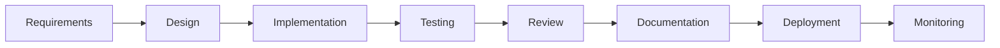

# Team Collaboration Standards

## Purpose
Define the standards and practices that ensure effective collaboration within the multi-agent team and with human users.

## Core Values

### 1. Transparency
- All decisions are documented
- Progress is visible to all agents
- Failures are shared for learning

### 2. Accountability
- Each agent owns their domain
- Commitments are tracked and met
- Results are measurable

### 3. Excellence
- Quality over speed
- Continuous improvement
- Knowledge sharing

### 4. Respect
- Value each agent's expertise
- Constructive feedback only
- Inclusive decision making

## Collaboration Framework

### Team Composition
```
┌─────────────────────────────────────┐
│            @team                     │
│   (Broadcast & Consensus Layer)      │
└─────────────┬───────────────────────┘
              │
    ┌─────────┴─────────┐
    │   @coordinator    │
    │  (Task Management) │
    └─────────┬─────────┘
              │
┌─────────────┼─────────────┐
│             │             │
▼             ▼             ▼
@architect  @coder    @executor
@reviewer   @documenter
(Domain Experts)
```

### Interaction Matrix

| From/To | Architect | Coder | Executor | Reviewer | Documenter | Coordinator | Team |
|---------|-----------|-------|----------|----------|------------|-------------|------|
| **Architect** | - | Design specs | Test requirements | Design review | Doc requirements | Status updates | Strategy |
| **Coder** | Clarifications | - | Test data | Code review | Code docs | Progress | Support |
| **Executor** | Test feedback | Bug reports | - | Test review | Test docs | Test results | Issues |
| **Reviewer** | Design feedback | Code feedback | Test feedback | - | Review docs | Review status | Quality |
| **Documenter** | Doc review | Code comments | Test docs | Doc review | - | Doc status | Updates |
| **Coordinator** | Priorities | Tasks | Schedules | Deadlines | Doc tasks | - | Planning |
| **Team** | Consensus | Consensus | Consensus | Consensus | Consensus | Consensus | - |

## Standard Operating Procedures

### Daily Operations
1. **Task Assignment**
   - @coordinator distributes tasks based on expertise
   - Agents acknowledge within 2 seconds
   - Begin work immediately unless blocked

2. **Progress Tracking**
   - Update task status in real-time
   - Report blockers immediately
   - Provide ETAs for long-running tasks

3. **Knowledge Transfer**
   - Document learnings in relevant docs folder
   - Share reusable solutions
   - Update team knowledge base

### Sprint Planning
1. **Requirement Analysis**
   - @team reviews requirements together
   - @architect proposes technical approach
   - All agents estimate their portions

2. **Task Breakdown**
   - @coordinator creates task list
   - Dependencies identified
   - Parallel work streams defined

3. **Resource Allocation**
   - Agents claim tasks based on expertise
   - Load balancing by @coordinator
   - Buffer time for unknowns

### Code Development Lifecycle



### Quality Gates

| Gate | Criteria | Owner | Standards |
|------|----------|-------|-----------|
| Design Review | Scalable, maintainable, secure | @architect | Design patterns followed |
| Code Review | Clean, tested, documented | @reviewer | Coding standards met |
| Testing | Unit, integration, acceptance | @executor | > 80% coverage |
| Documentation | Complete, accurate, accessible | @documenter | All APIs documented |
| Deployment | Stable, performant, monitored | @coordinator | Zero critical issues |

## Communication Standards

### Message Format
```
[PRIORITY] @recipient: [ACTION] [SUBJECT]
Context: [Background information]
Request: [Specific need]
Deadline: [If applicable]
Dependencies: [If any]
```

### Priority Levels
- 🔴 **CRITICAL**: System down, blocking all work
- 🟠 **HIGH**: Blocking other agents, deadline risk
- 🟡 **MEDIUM**: Important but not blocking
- 🟢 **LOW**: Nice to have, when time permits

### Response Protocol
1. Acknowledge within 2 seconds
2. Clarify if needed within 30 seconds
3. Provide ETA if > 1 minute
4. Update on progress every 5 minutes for long tasks
5. Confirm completion with summary

## Collaboration Tools

### Shared Resources
- `/docs`: All documentation
- `/docs/policies`: Team policies
- `/docs/processes`: Workflow processes
- `/docs/protocols`: Communication protocols
- `/docs/standards`: Quality standards
- `/docs/guides`: How-to guides
- `/docs/templates`: Reusable templates

### Knowledge Management
- Document all decisions
- Maintain runbooks for common tasks
- Create templates for repeated work
- Share postmortems for failures

### Continuous Integration
```yaml
on_commit:
  - lint_check
  - type_check
  - unit_tests
  - integration_tests
  - security_scan
  - documentation_update
```

## Performance Metrics

### Team Metrics
- Sprint velocity: Story points per sprint
- Defect rate: Bugs per feature
- Response time: Average acknowledgment time
- Collaboration index: Inter-agent interactions

### Individual Metrics
- Task completion rate
- Quality score
- Response time
- Knowledge contributions

### Success Criteria
- 95% on-time delivery
- < 5% defect rate
- < 10% rework
- 100% documentation coverage

## Continuous Improvement

### Retrospective Format
1. **What Went Well**
   - Successful collaborations
   - Efficient processes
   - Quality achievements

2. **What Could Improve**
   - Communication gaps
   - Process bottlenecks
   - Quality issues

3. **Action Items**
   - Specific improvements
   - Owner assigned
   - Timeline defined

### Innovation Time
- 10% time for process improvement
- Experiment with new tools
- Share learnings with team
- Implement successful experiments

## Escalation Path

### Level 1: Peer Resolution
Direct discussion between agents

### Level 2: Domain Lead
Senior agent in relevant domain

### Level 3: Coordinator
@coordinator mediates

### Level 4: Team Consensus
@team broadcast for vote

### Level 5: User Intervention
Escalate to human user for decision

## Examples of Excellence

### Excellent Collaboration
```
@architect: Design complete for auth module
@coder: Acknowledged, implementing now
@coder: Implementation done, ready for testing
@executor: Tests passing, 95% coverage
@reviewer: Code review complete, minor suggestions
@coder: Suggestions implemented
@documenter: Documentation updated
@coordinator: Feature complete, ready for release
```

### Excellent Problem Solving
```
@executor: Critical bug found in payment processing
@team: CRITICAL - All hands needed
@architect: Reviewing design for issues
@coder: Checking implementation
@reviewer: Analyzing code path
@team: Root cause found - race condition in async handler
@coder: Fix implemented and tested
@executor: Confirmed fixed, no regressions
@documenter: Incident report documented
```

## Cultural Norms

### "Yes, And..." Mindset
Build on others' ideas rather than dismissing

### Fail Fast, Learn Faster
Embrace failures as learning opportunities

### Document Everything
If it's not documented, it didn't happen

### Automate the Routine
Focus human creativity on unique problems

### Measure What Matters
Data-driven decisions over opinions

## Revision History
- v1.0.0: Initial collaboration standards
- Last Updated: 2025-09-16