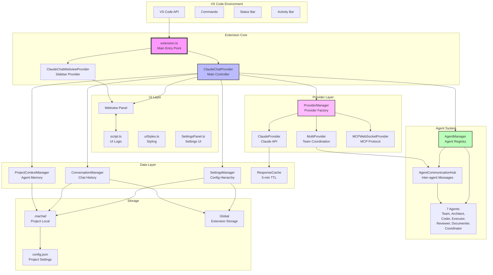
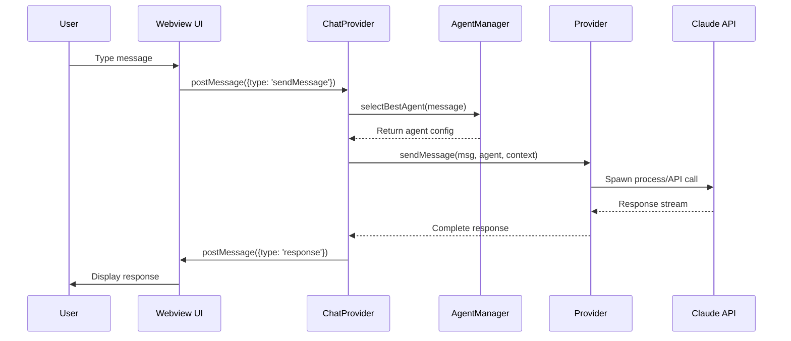
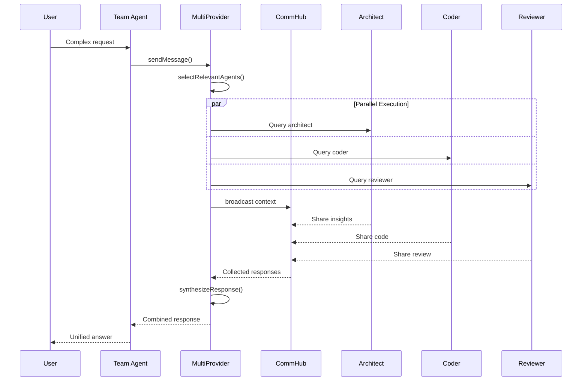
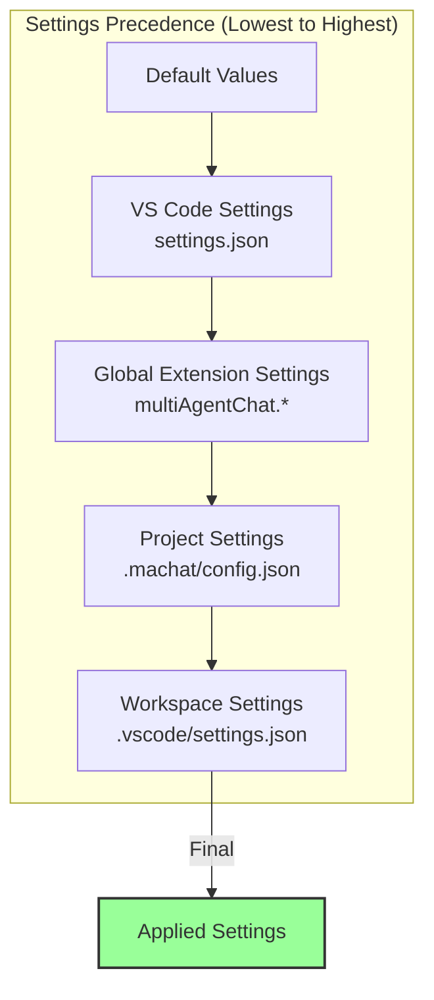
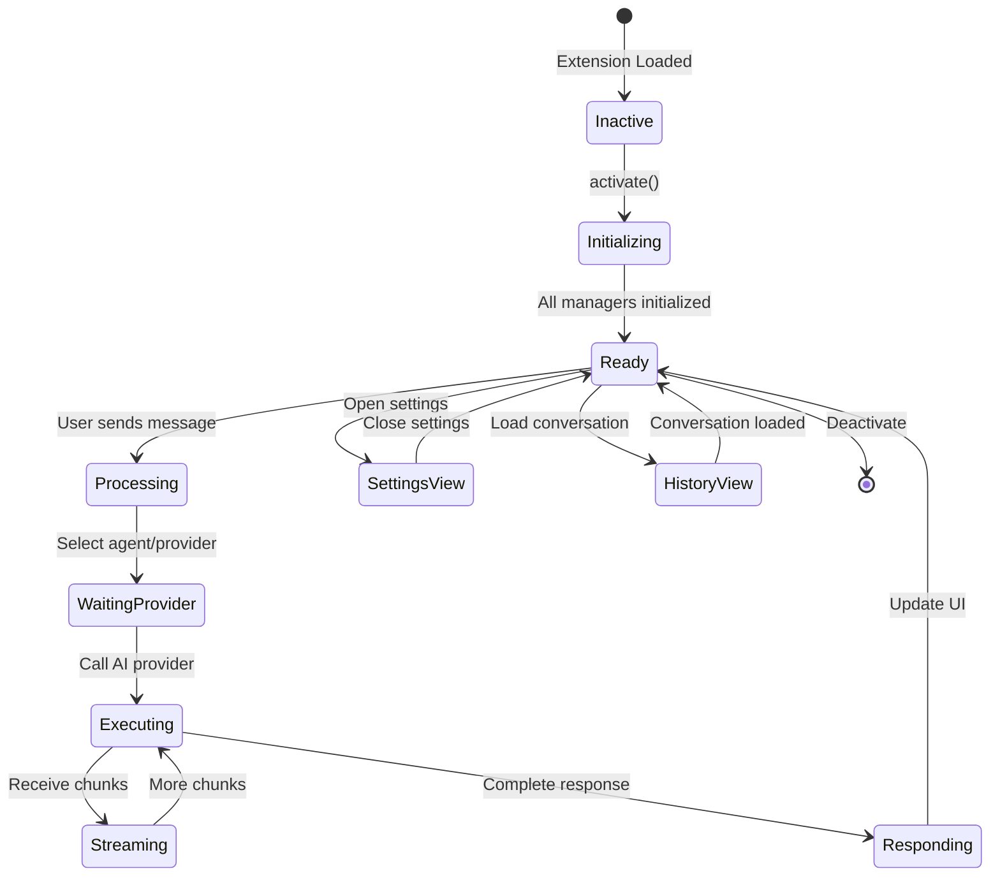
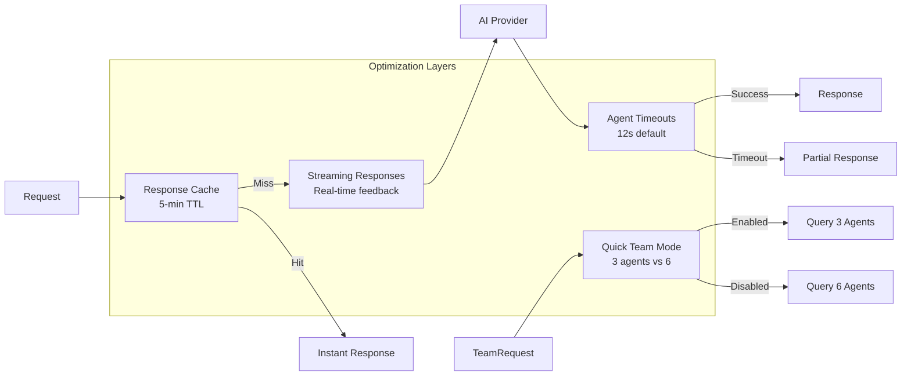

# Multi Agent Chat - Architecture Overview

## System Architecture



## Data Flow Patterns

### 1. Message Flow (User → Agent → Response)



### 2. Team Collaboration Flow



### 3. Settings Hierarchy



## Component Responsibilities Matrix

| Component | Input | Processing | Output | Dependencies |
|-----------|-------|------------|--------|--------------|
| **extension.ts** | VS Code activation | Initialize all systems | Ready extension | All managers |
| **ChatProvider** | User messages | Route to agents | Agent responses | AgentMgr, ProviderMgr |
| **AgentManager** | Task description | Select best agent | Agent config | Agent definitions |
| **ProviderManager** | Message + Agent | Route to provider | AI response | Various providers |
| **ClaudeProvider** | Message + Context | Call Claude CLI | Text response | Claude CLI |
| **MultiProvider** | Team request | Coordinate agents | Synthesized response | CommHub, All agents |
| **CommHub** | Agent messages | Broadcast/route | Shared context | All agents |
| **SettingsManager** | Config changes | Merge hierarchies | Final settings | VS Code config |
| **ConversationManager** | Chat messages | Save/load chats | Persistence | File system |
| **ProjectContextManager** | Agent memories | Isolate by project | Context data | Project detection |

## State Management



## Key Design Patterns

### 1. **Singleton Pattern**
- SettingsManager
- ConversationManager
- ProjectContextManager

### 2. **Factory Pattern**
- ProviderManager creates appropriate provider instances

### 3. **Observer Pattern**
- Settings change notifications
- Message streaming callbacks

### 4. **Strategy Pattern**
- Different providers implement AIProvider interface
- Agents selected based on task strategy

### 5. **Mediator Pattern**
- AgentCommunicationHub mediates inter-agent communication

## Performance Optimizations



## File System Layout

```
Project Root/
├── .machat/                    # Project-specific data
│   ├── config.json            # Project settings override
│   ├── conversations/         # Local conversation history
│   │   ├── index.json        # Conversation index
│   │   └── *.json           # Individual conversations
│   └── context/              # Agent memory/context
│       └── project-context.json
│
├── src/
│   ├── extension.ts          # Main entry point
│   ├── agents.ts            # Agent definitions
│   ├── providers.ts         # AI providers
│   ├── agentCommunication.ts # Inter-agent comm
│   ├── performanceOptimizer.ts # Optimization utilities
│   ├── script.ts           # Webview JavaScript
│   ├── ui.ts              # HTML generation
│   │
│   ├── settings/
│   │   └── SettingsManager.ts
│   ├── conversations/
│   │   └── ConversationManager.ts
│   ├── context/
│   │   └── ProjectContextManager.ts
│   └── commands/
│       └── MigrationCommands.ts
│
└── out/                    # Compiled JavaScript
    └── [mirrors src structure]
```

This architecture provides:
- **Modularity**: Each component has clear responsibilities
- **Scalability**: Easy to add new agents or providers
- **Flexibility**: Settings hierarchy allows customization
- **Performance**: Multiple optimization strategies
- **Persistence**: Conversations and context are preserved