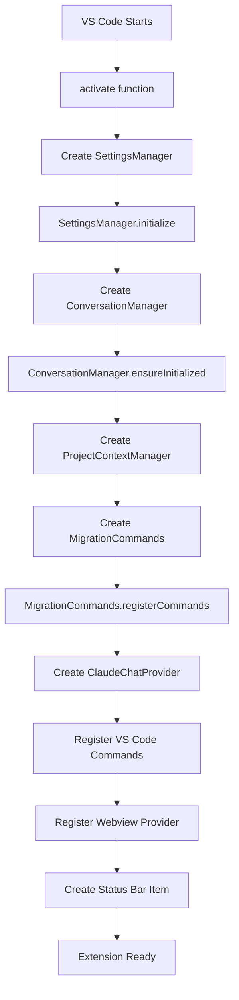
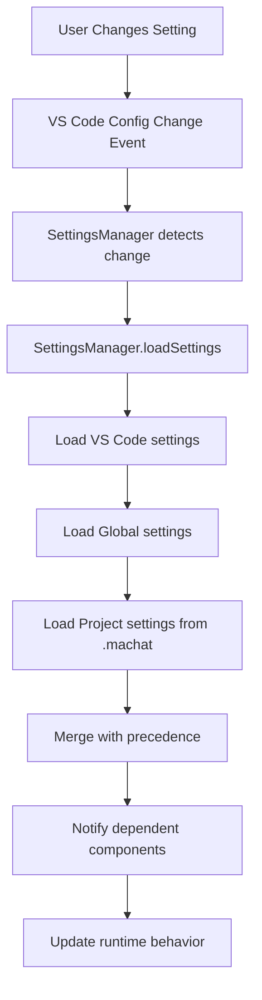
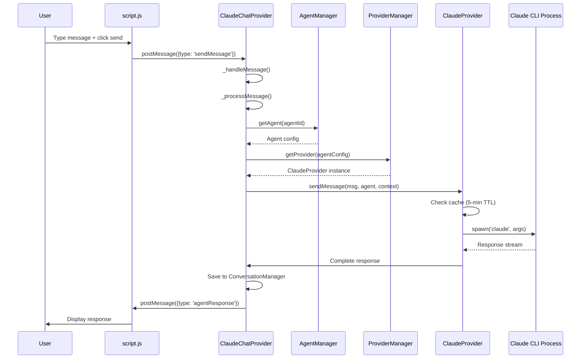
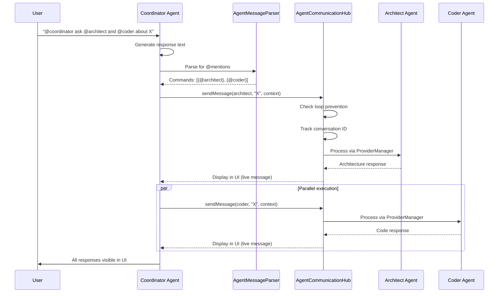
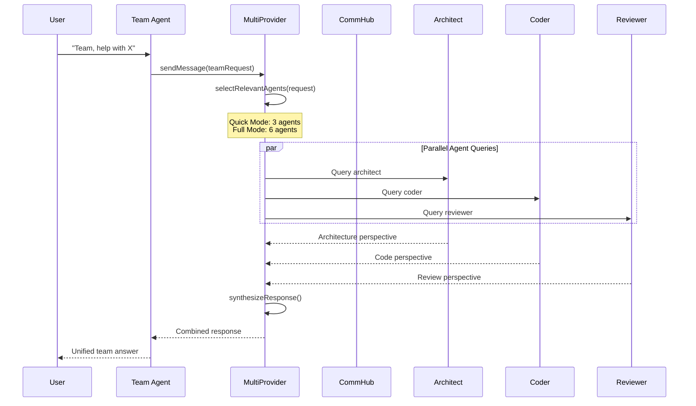
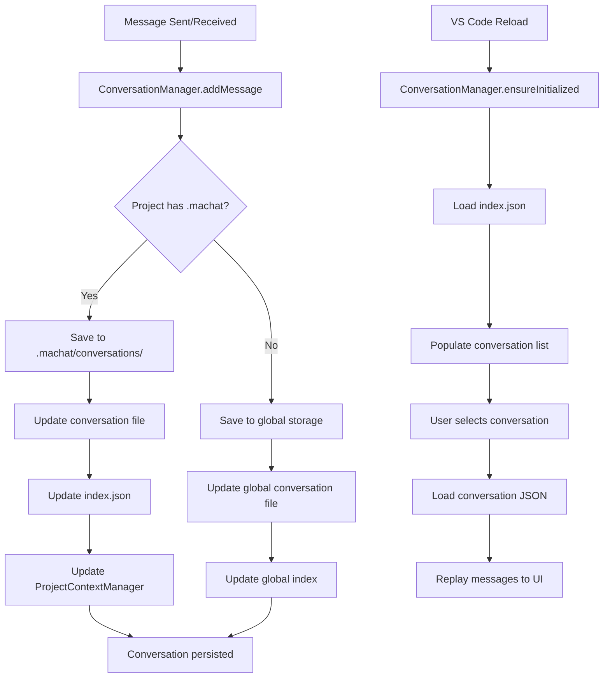
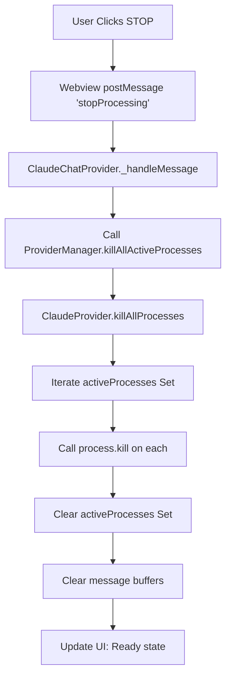

# Multi Agent Chat - Code Flow Documentation

**Last Updated:** 2025-09-30 (v1.13.0)
**Status:** ✅ Accurate - focuses on concepts, not specific line numbers

---

This document explains how code flows through the Multi Agent Chat extension for core scenarios. Flows are presented conceptually to remain accurate as code evolves.

## Table of Contents

1. [Extension Initiation](#1-extension-initiation)
2. [Settings Change](#2-settings-change)
3. [Single Agent Communication](#3-single-agent-communication)
4. [Inter-Agent Communication (@mentions)](#4-inter-agent-communication-mentions)
5. [Team Coordination](#5-team-coordination)
6. [Conversation Persistence](#6-conversation-persistence)
7. [STOP Button Flow](#7-stop-button-flow)

---

## 1. Extension Initiation

When VS Code starts or the extension is activated:



### Key Components Initialized

| Component | Purpose | Storage Location |
|-----------|---------|------------------|
| **SettingsManager** | Load hierarchical settings | VS Code config + `.machat/config.json` |
| **ConversationManager** | Set up conversation storage | `.machat/conversations/` |
| **ProjectContextManager** | Initialize agent memory | `.machat/context/` |
| **MigrationCommands** | Register migration utilities | Command palette |
| **ClaudeChatProvider** | Main controller instance | In-memory |
| **AgentManager** | Load 7 agent definitions | In-memory |
| **ProviderManager** | Initialize AI providers | In-memory |
| **AgentCommunicationHub** | Set up inter-agent messaging | In-memory |

### Files Involved

- `src/extension.ts` - Main activation function
- `src/settings/SettingsManager.ts` - Settings singleton
- `src/conversations/ConversationManager.ts` - Conversation persistence
- `src/context/ProjectContextManager.ts` - Agent memory
- `src/agents.ts` - Agent definitions
- `src/providers.ts` - Provider implementations

---

## 2. Settings Change

When a user changes settings (via VS Code settings UI or `.machat/config.json`):



### Settings Hierarchy (lowest to highest precedence)

1. Default values in code
2. VS Code global settings (`settings.json`)
3. Global extension settings
4. Project settings (`.machat/config.json`)
5. Workspace settings (`.vscode/settings.json`)

### Example Settings Flow

```typescript
// User changes: multiAgentChat.agents.enableInterCommunication = false
// → SettingsManager reloads all layers
// → Merges with precedence
// → AgentCommunicationHub sees change
// → Disables @mention parsing in future messages
```

---

## 3. Single Agent Communication

Standard message flow (no @mentions, no team coordination):



### Key Decision Points

1. **Cache Check**: If identical request within 5 minutes, return cached response
2. **Streaming**: If enabled, send chunks to UI in real-time
3. **Context**: Include conversation history and project context

### Files Involved

- `resources/webview/script.js` - UI logic
- `src/extension.ts` - ClaudeChatProvider message handling
- `src/agents.ts` - Agent registry
- `src/providers.ts` - Provider routing and Claude CLI interaction
- `src/performanceOptimizer.ts` - Cache management

---

## 4. Inter-Agent Communication (@mentions)

When an agent response contains @mentions (v1.13.0 feature):



### Loop Prevention

The AgentCommunicationHub prevents infinite loops by:

1. Tracking conversation depth (max 3 levels)
2. Limiting messages per conversation (max 50)
3. Blocking simple acknowledgment responses (< 100 chars)
4. Setting `isInterAgentResponse: true` flag to prevent nested @mentions

### Message Flow Example

```
User: "@coordinator ask @architect about database design"
  → Coordinator receives message
  → Generates initial response: "I'll consult the architect. @architect ..."
  → MessageParser extracts: [@architect]
  → CommHub sends to Architect with original context
  → Architect responds (visible live in UI)
  → Coordinator doesn't trigger new @mentions (isInterAgentResponse flag)
```

### Files Involved

- `src/agentMessageParser.ts` - Extract @mentions from responses
- `src/agentCommunication.ts` - Route messages, prevent loops
- `src/providers.ts` - Execute agent requests
- `resources/webview/script.js` - Display live inter-agent messages

---

## 5. Team Coordination

When user explicitly requests Team agent:



### Team Mode Optimization

- **Quick Team Mode** (default): Selects 3 most relevant agents
- **Full Team Mode**: Queries all 6 specialized agents
- Configured via: `multiAgentChat.performance.quickTeamMode`

### Agent Selection Strategy

```typescript
// MultiProvider analyzes request and selects:
// - Keywords match (e.g., "code" → Coder)
// - Complexity match (e.g., architecture question → Architect)
// - Task type (e.g., review → Reviewer)
```

### Files Involved

- `src/providers.ts` - MultiProvider coordination
- `src/performanceOptimizer.ts` - OptimizedMultiProvider
- `src/agentCommunication.ts` - Message broadcasting
- `src/agents.ts` - Agent capabilities and specializations

---

## 6. Conversation Persistence

How conversations are saved, indexed, and reloaded:



### Storage Structure

```
.machat/
├── conversations/
│   ├── index.json                    # List of all conversations
│   └── 2025-09-30_14-23_title.json  # Individual conversation
└── context/
    └── project-context.json          # Agent memories
```

### Conversation File Format

```json
{
  "id": "conv_abc123",
  "title": "Discussing architecture",
  "agent": "architect",
  "timestamp": "2025-09-30T14:23:00.000Z",
  "messages": [
    {
      "role": "user",
      "content": "Explain SOLID principles",
      "timestamp": "2025-09-30T14:23:05.000Z"
    },
    {
      "role": "assistant",
      "content": "SOLID stands for...",
      "timestamp": "2025-09-30T14:23:15.000Z"
    }
  ]
}
```

### Files Involved

- `src/conversations/ConversationManager.ts` - Save/load/index
- `src/context/ProjectContextManager.ts` - Agent memory
- `src/extension.ts` - Trigger saves on message completion

---

## 7. STOP Button Flow

When user clicks STOP to kill all running processes:



### Process Tracking

```typescript
// ClaudeProvider maintains activeProcesses Set
private activeProcesses: Set<cp.ChildProcess> = new Set();

// On spawn:
const process = cp.spawn('claude', args);
this.activeProcesses.add(process);

// On STOP:
this.activeProcesses.forEach(p => p.kill());
this.activeProcesses.clear();
```

### Files Involved

- `resources/webview/script.js` - STOP button UI
- `src/extension.ts` - Message routing
- `src/providers.ts` - Process management

---

## Common Patterns & Practices

### 1. Message Passing (Extension ↔ Webview)

```typescript
// Webview → Extension
vscode.postMessage({ type: 'sendMessage', data: userInput });

// Extension → Webview
webview.postMessage({ type: 'agentResponse', data: response, agent: {...} });
```

### 2. Singleton Managers

```typescript
// Always use getInstance() for managers
const settingsManager = SettingsManager.getInstance(context);
const conversationManager = ConversationManager.getInstance(context, settingsManager);
const contextManager = ProjectContextManager.getInstance(context, settingsManager);
```

### 3. Provider Routing

```typescript
// ProviderManager routes based on agent config
const provider = providerManager.getProvider(agentConfig);
// Returns: ClaudeProvider | OpenAIProvider | MultiProvider
```

### 4. Context Building

Every AI request includes:

- Conversation history (last N messages)
- Agent-specific context
- Project context (if `.machat/` exists)
- User's current file/selection (if relevant)

### 5. Error Handling

```typescript
// Always wrap AI calls in try/catch
try {
    const response = await provider.sendMessage(...);
    // Save and display
} catch (error) {
    // Show error in UI
    // Log to output channel
    // Don't crash extension
}
```

---

## Debugging Tips

### 1. Extension Output Channel

View detailed logs:

1. Open Output panel (View → Output)
2. Select "Multi-Agent Communication" from dropdown
3. See message routing, agent selection, errors

### 2. Message Flow Logging

Look for these console logs:

```
[ClaudeProvider] Using direct Claude CLI for architect
[AgentCommunicationHub] Broadcasting to 3 agents
[MessageParser] Found @mentions: ["architect", "coder"]
[Loop Prevention] Blocking acknowledgment loop
```

### 3. Conversation Files

Inspect actual conversation data:

```bash
cat .machat/conversations/2025-09-30_*.json
cat .machat/conversations/index.json
cat .machat/context/project-context.json
```

### 4. Settings Hierarchy

Check effective settings:

```typescript
// In extension.ts
const config = vscode.workspace.getConfiguration('multiAgentChat');
console.log('Effective settings:', config);
```

---

## Architecture Evolution

### v1.13.0 (2025-09-30)

- ✅ Inter-agent communication polish (@mentions fully working)
- ✅ External resources (webview in `resources/webview/`)
- ✅ Loop prevention for inter-agent messages
- ✅ STOP button kills all processes immediately

### v1.11.0 (2025-09-19)

- ✅ MCP infrastructure removed (simplified to direct Claude CLI)
- ✅ Per-project settings (`.machat/config.json`)
- ✅ Project-local conversation storage

### Pre-v1.11.0

- ❌ MCP WebSocket server (removed - was complex, not needed)
- ❌ Template literal webview (removed - maintenance nightmare)

---

*Flows accurate as of v1.13.0 (2025-09-30)*
*Focused on concepts rather than specific line numbers for maintainability*
*See `docs/ARCHITECTURE_DIAGRAM.md` for system architecture diagrams*
