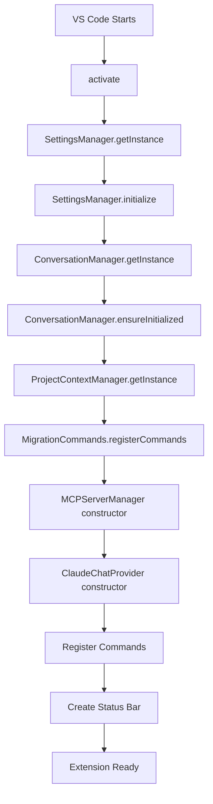
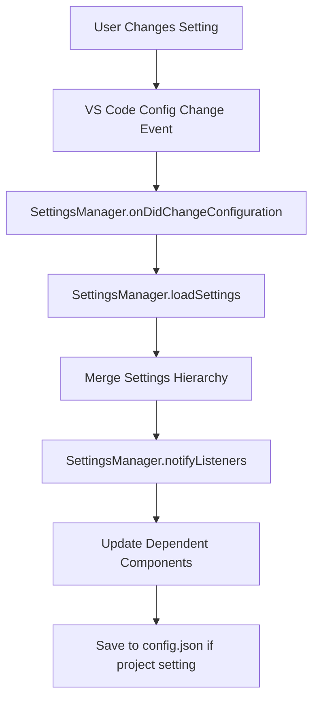
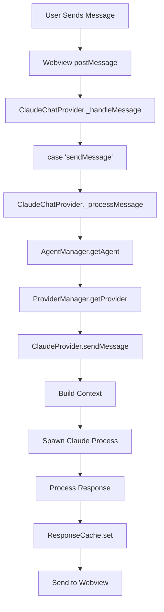
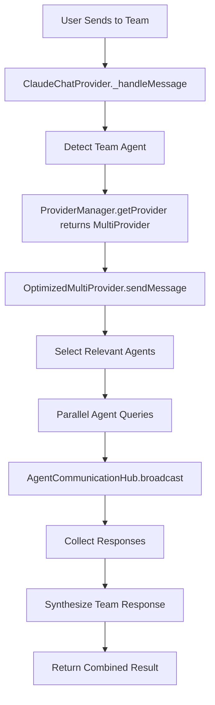
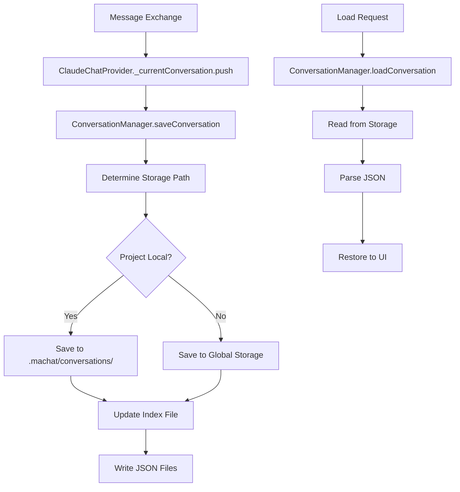
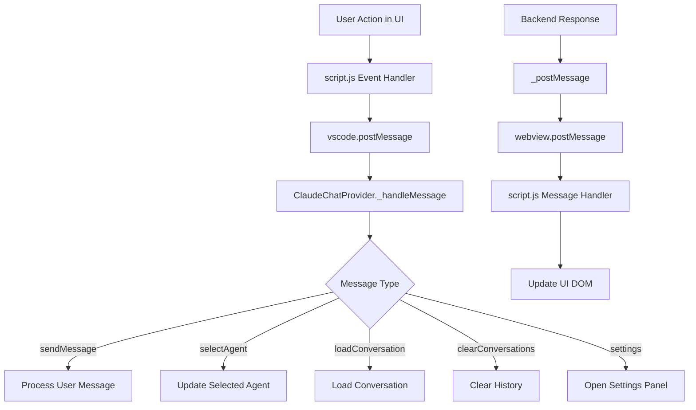
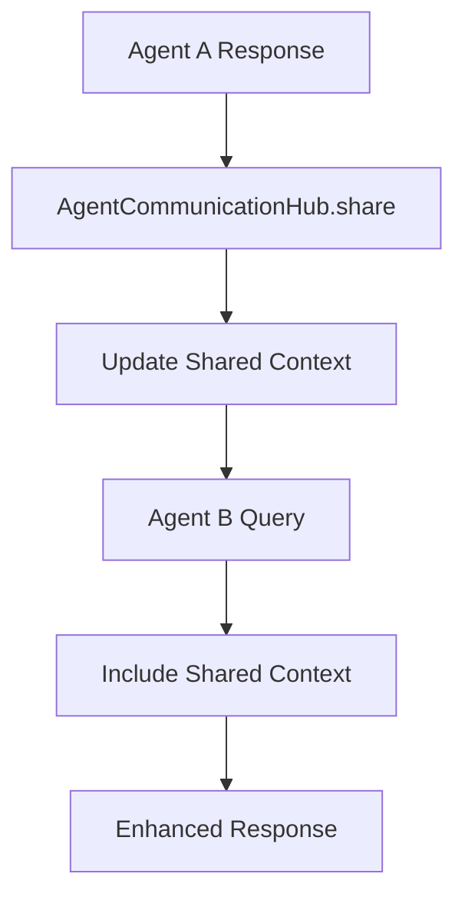
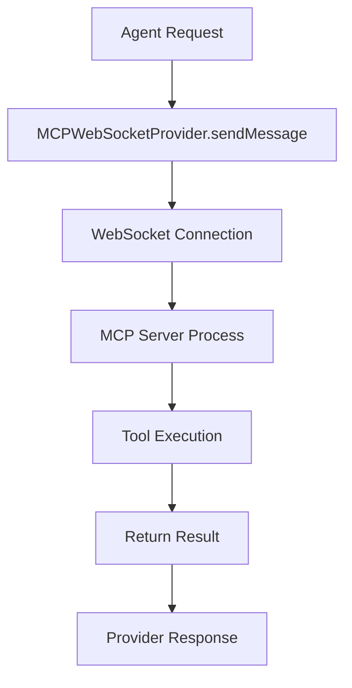

# Multi Agent Chat - Code Flow Documentation

This document explains how code flows through the Multi Agent Chat extension for core scenarios. Each flow shows the sequence of function calls, the files involved, and brief descriptions.

## Table of Contents
1. [Extension Initiation](#1-extension-initiation)
2. [Settings Change](#2-settings-change)
3. [Single Agent Communication](#3-single-agent-communication)
4. [Multi-Agent/Team Communication](#4-multi-agentteam-communication)
5. [Conversation Persistence](#5-conversation-persistence)
6. [Webview Message Handling](#6-webview-message-handling)

---

## 1. Extension Initiation

When VS Code starts or the extension is activated, this flow executes:

### Function Details:

| Function | File | Purpose |
|----------|------|---------|
| `activate()` | `src/extension.ts:18` | Main entry point when extension activates |
| `SettingsManager.getInstance()` | `src/settings/SettingsManager.ts` | Get singleton settings manager |
| `SettingsManager.initialize()` | `src/settings/SettingsManager.ts` | Load all settings layers |
| `ConversationManager.getInstance()` | `src/conversations/ConversationManager.ts` | Get conversation manager singleton |
| `ConversationManager.ensureInitialized()` | `src/conversations/ConversationManager.ts` | Set up conversation storage paths |
| `ProjectContextManager.getInstance()` | `src/context/ProjectContextManager.ts` | Initialize project context manager |
| `MigrationCommands.registerCommands()` | `src/commands/MigrationCommands.ts` | Register migration-related commands |
| `MCPServerManager()` | `src/mcp-server/serverManager.ts` | Initialize MCP server if enabled |
| `ClaudeChatProvider()` | `src/extension.ts:167` | Create main chat provider instance |
| `vscode.commands.registerCommand()` | `src/extension.ts:42-75` | Register VS Code commands |
| `vscode.window.createStatusBarItem()` | `src/extension.ts:68` | Create status bar icon |

---

## 2. Settings Change

When a user changes settings, this flow handles the update:

### Function Details:

| Function | File | Purpose |
|----------|------|---------|
| `onDidChangeConfiguration()` | VS Code API | Built-in config change event |
| `SettingsManager.loadSettings()` | `src/settings/SettingsManager.ts` | Reload all settings layers |
| `SettingsManager.mergeSettings()` | `src/settings/SettingsManager.ts` | Apply settings precedence |
| `SettingsManager.notifyListeners()` | `src/settings/SettingsManager.ts` | Notify components of changes |
| `SettingsManager.saveProjectSettings()` | `src/settings/SettingsManager.ts` | Persist project-specific settings |

---

## 3. Single Agent Communication

When a user sends a message to a single agent:

### Function Details:

| Function | File | Purpose |
|----------|------|---------|
| `webview.postMessage()` | `src/extension.ts` | Send message from UI to extension |
| `ClaudeChatProvider._handleMessage()` | `src/extension.ts:550` | Main message handler |
| `ClaudeChatProvider._processMessage()` | `src/extension.ts:820` | Process user input |
| `AgentManager.getAgent()` | `src/agents.ts:104` | Get agent configuration |
| `ProviderManager.getProvider()` | `src/providers.ts:217` | Get AI provider for agent |
| `ClaudeProvider.sendMessage()` | `src/providers.ts:39` | Send to Claude API |
| `ResponseCache.set()` | `src/performanceOptimizer.ts` | Cache response if enabled |
| `_postMessage()` | `src/extension.ts:1620` | Send response to UI |

---

## 4. Multi-Agent/Team Communication

When using the Team agent for collaborative responses:

### Function Details:

| Function | File | Purpose |
|----------|------|---------|
| `OptimizedMultiProvider.sendMessage()` | `src/performanceOptimizer.ts:280` | Handle team coordination |
| `selectRelevantAgents()` | `src/performanceOptimizer.ts:320` | Choose agents based on task |
| `AgentCommunicationHub.broadcast()` | `src/agentCommunication.ts:45` | Send to multiple agents |
| `AgentCommunicationHub.requestResponse()` | `src/agentCommunication.ts:78` | Get response from specific agent |
| `Promise.race()` | `src/performanceOptimizer.ts:370` | Handle agent timeouts |
| `synthesizeResponse()` | `src/performanceOptimizer.ts:400` | Combine agent responses |

---

## 5. Conversation Persistence

How conversations are saved and loaded:

### Function Details:

| Function | File | Purpose |
|----------|------|---------|
| `ConversationManager.saveConversation()` | `src/conversations/ConversationManager.ts:150` | Save conversation data |
| `ConversationManager.getStoragePath()` | `src/conversations/ConversationManager.ts:85` | Determine storage location |
| `ConversationManager.updateIndex()` | `src/conversations/ConversationManager.ts:220` | Update conversation index |
| `ConversationManager.loadConversation()` | `src/conversations/ConversationManager.ts:180` | Load conversation from disk |
| `ProjectContextManager.saveContext()` | `src/context/ProjectContextManager.ts:120` | Save agent memory/context |

---

## 6. Webview Message Handling

How messages flow between the UI and extension backend:

### Function Details:

| Function | File | Purpose |
|----------|------|---------|
| `vscode.postMessage()` | `src/script.ts` | Send from webview to extension |
| `ClaudeChatProvider._handleMessage()` | `src/extension.ts:550-650` | Route messages by type |
| `ClaudeChatProvider._postMessage()` | `src/extension.ts:1620` | Send to webview |
| `window.addEventListener('message')` | `src/script.ts` | Receive in webview |
| `updateUI()` | `src/script.ts` | Update webview DOM |
| `renderMarkdown()` | `src/script.ts` | Render agent responses |

---

## Additional Key Flows

### Agent Context Sharing
When agents need to share context during collaboration:

### MCP Server Communication
When using MCP server for enhanced capabilities:

---

## Quick Reference: Core File Responsibilities

| File | Primary Responsibility |
|------|------------------------|
| `extension.ts` | Main extension entry, command registration, webview management |
| `agents.ts` | Agent configurations and routing logic |
| `providers.ts` | AI provider implementations (Claude, MCP, Multi) |
| `agentCommunication.ts` | Inter-agent communication hub |
| `performanceOptimizer.ts` | Caching, streaming, team optimization |
| `settings/SettingsManager.ts` | Hierarchical settings management |
| `conversations/ConversationManager.ts` | Conversation persistence |
| `context/ProjectContextManager.ts` | Project-specific agent memory |
| `script.ts` | Webview UI JavaScript |
| `ui.ts` | Webview HTML generation |

---

## Tips for Code Navigation

1. **Start with `extension.ts:activate()`** - This is where everything begins
2. **Follow `_handleMessage()`** - This is the main message router
3. **Check provider implementations** - `providers.ts` has the core AI logic
4. **Trace through AgentManager** - `agents.ts` shows how agents are selected
5. **Review settings flow** - `SettingsManager.ts` controls configuration

Use VS Code's "Go to Definition" (F12) and "Find All References" (Shift+F12) to navigate through these flows interactively.