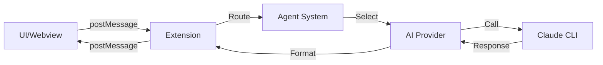

# Multi Agent Chat - Quick Reference Guide

## 🎯 Key Entry Points for Understanding the Code

### Where to Start Reading

1. **`src/extension.ts:activate()`** (Line 18)
   - This is where EVERYTHING starts
   - Follow this to understand initialization

2. **`src/extension.ts:_handleMessage()`** (Line 550)
   - This routes ALL messages from the UI
   - Put a breakpoint here to trace any user action

3. **`src/providers.ts:sendMessage()`** (Line 39)
   - This is where AI calls happen
   - Trace this to understand Claude integration

4. **`src/agents.ts:selectBestAgent()`** (Line 143)
   - This decides which agent handles a request
   - Key to understanding agent routing

## 🔍 Debugging Tips

### Setting Breakpoints

```javascript
// Most useful breakpoints:

// 1. See every user message
src/extension.ts:550  // _handleMessage()

// 2. See agent selection
src/agents.ts:143     // selectBestAgent()

// 3. See AI provider calls
src/providers.ts:39   // sendMessage()

// 4. See team coordination
src/performanceOptimizer.ts:280  // OptimizedMultiProvider.sendMessage()

// 5. See settings changes
src/settings/SettingsManager.ts:120  // loadSettings()
```

### Console Logging Points

The code already has many `console.log()` statements. View them:
1. Open VS Code Developer Tools: `Help → Toggle Developer Tools`
2. Go to Console tab
3. Filter by "Multi Agent Chat"

### VS Code Debug Configuration

Add to `.vscode/launch.json`:

```json
{
    "version": "0.2.0",
    "configurations": [
        {
            "name": "Run Extension",
            "type": "extensionHost",
            "request": "launch",
            "runtimeExecutable": "${execPath}",
            "args": [
                "--extensionDevelopmentPath=${workspaceFolder}"
            ],
            "outFiles": [
                "${workspaceFolder}/out/**/*.js"
            ],
            "preLaunchTask": "npm: watch"
        }
    ]
}
```

## 🎮 Command Palette Commands

All available commands you can run:

| Command | ID | Keyboard Shortcut |
|---------|-----|-------------------|
| Open Multi Agent Chat | `multiAgentChat.openChat` | `Ctrl+Shift+C` |
| Clear All Conversations | `multiAgentChat.clearAllConversations` | - |
| Initialize Project | `multiAgentChat.initializeProject` | - |
| Migrate Conversations | `multiAgentChat.migrateConversations` | - |
| Show Migration Status | `multiAgentChat.showMigrationStatus` | - |

## 📁 Important File Locations

### Configuration Files
- **User Settings**: `~/.config/Code/User/settings.json`
- **Project Settings**: `.machat/config.json`
- **Workspace Settings**: `.vscode/settings.json`

### Data Storage
- **Global Conversations**: `~/.config/Code/User/globalStorage/[extension-id]/conversations/`
- **Project Conversations**: `.machat/conversations/`
- **Agent Context**: `.machat/context/project-context.json`

## 🔄 Common Code Paths

### When User Sends a Message

```
1. User types in UI
2. script.ts → sendButton.click()
3. vscode.postMessage({type: 'sendMessage', text: ...})
4. extension.ts → _handleMessage() case 'sendMessage'
5. extension.ts → _processMessage()
6. agents.ts → selectBestAgent() OR use selected agent
7. providers.ts → getProvider()
8. providers.ts → sendMessage()
9. Claude CLI spawned
10. Response returned
11. extension.ts → _postMessage({type: 'response'})
12. script.ts → window.addEventListener('message')
13. UI updated
```

### When Team Agent is Used

```
1. User selects Team agent
2. Message sent (steps 1-6 above)
3. providers.ts → MultiProvider returned
4. performanceOptimizer.ts → OptimizedMultiProvider.sendMessage()
5. Select 3-6 agents based on task
6. Parallel queries to each agent
7. agentCommunication.ts → broadcast context
8. Collect all responses
9. Synthesize into team response
10. Return unified answer
```

## 🛠️ Modifying Common Features

### Add a New Agent

1. Edit `src/agents.ts`
2. Add to `defaultAgents` array (line 15)
3. Update `selectBestAgent()` logic (line 143)
4. Restart extension

### Change Default Model

1. Edit `src/providers.ts`
2. Modify `agentConfig.model` default (line 100)
3. Or change in settings: `multiAgentChat.defaultModel`

### Adjust Performance Settings

Edit in VS Code settings:
```json
{
    "multiAgentChat.performance.enableStreaming": true,
    "multiAgentChat.performance.enableCache": true,
    "multiAgentChat.performance.quickTeamMode": false,
    "multiAgentChat.performance.agentTimeout": 12000
}
```

### Modify UI Styling

1. Edit `src/ui.ts` for HTML structure
2. Edit `src/uiStyles.ts` for CSS styles
3. Recompile: `npm run compile`

## 📊 Data Flow Cheat Sheet



## 🔑 Key Variables to Watch

When debugging, watch these variables:

| Variable | Location | What It Shows |
|----------|----------|---------------|
| `this._selectedAgent` | `extension.ts:155` | Currently selected agent |
| `this._currentConversation` | `extension.ts:149` | Chat history |
| `message` | `_handleMessage():550` | Incoming UI messages |
| `agentConfig` | `providers.ts:40` | Agent being used |
| `context` | `providers.ts:40` | Conversation context |
| `this._agentSettings` | `extension.ts:156` | Agent-specific settings |

## 🚀 Performance Monitoring

### Check Response Times

Look for these console logs:
```
[Cache HIT] architect        // Response from cache
[ClaudeProvider] Using MCP   // Using MCP server
[Streaming] architect        // Streaming response
[Team] Query time: 3421ms    // Team response time
```

### Monitor Agent Communication

Open Output panel: `View → Output → Multi-Agent Communication`

## 📝 Testing Checklist

When testing changes:

- [ ] Test single agent response
- [ ] Test team collaboration
- [ ] Test conversation saving/loading
- [ ] Test settings changes
- [ ] Test project vs global storage
- [ ] Test error handling
- [ ] Check performance with cache on/off
- [ ] Verify streaming works
- [ ] Test timeout handling
- [ ] Check memory/context persistence

## 🆘 Common Issues & Solutions

| Issue | Solution | File to Check |
|-------|----------|---------------|
| Extension not loading | Check `package.json` activation events | `package.json:50` |
| Agent not responding | Verify Claude CLI works | `providers.ts:126` |
| Settings not applying | Check settings hierarchy | `SettingsManager.ts` |
| Conversations not saving | Check storage paths | `ConversationManager.ts:85` |
| Team not coordinating | Verify CommHub initialized | `agentCommunication.ts` |
| UI not updating | Check postMessage calls | `extension.ts:1620` |

## 💡 Pro Tips

1. **Use F12** (Go to Definition) to jump to any function
2. **Use Shift+F12** (Find All References) to see where something is used
3. **Use Ctrl+Shift+F** to search across all files
4. **Set `"multiAgentChat.outputChannel": true`** to see detailed logs
5. **Use the Output panel** to see inter-agent communication
6. **Check Developer Tools Console** for JavaScript errors in webview

---

Remember: The code flows from `extension.ts` → `agents.ts` → `providers.ts` → Claude → back to UI. Follow this path to understand any feature!