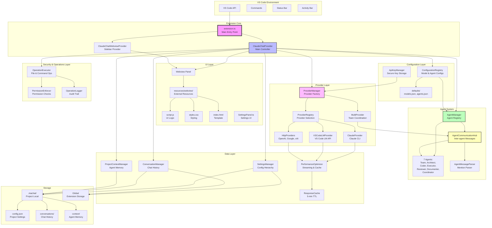
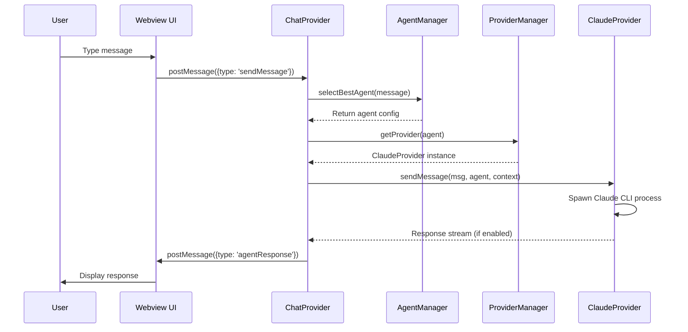
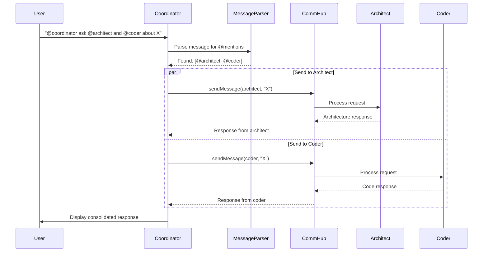
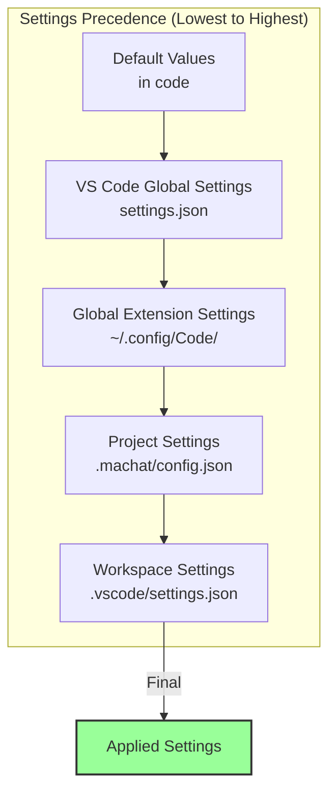
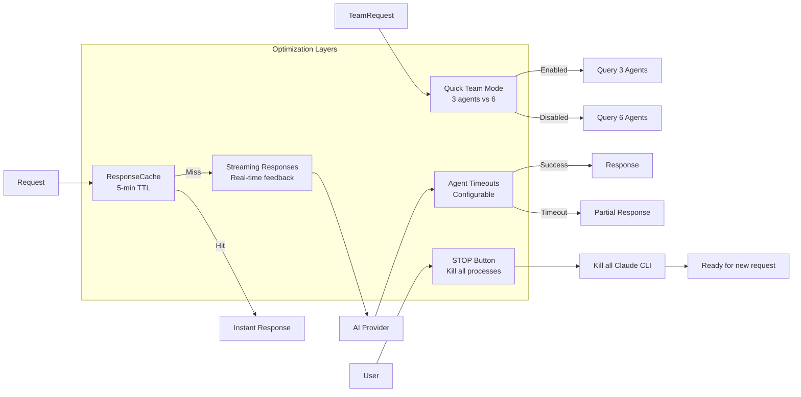

# Multi Agent Chat - Architecture Overview

**Last Updated:** 2025-10-07 (v1.16.1)
**Status:** ✅ Accurate as of current codebase

---

## System Architecture



## Data Flow Patterns

### 1. Message Flow (User → Agent → Response)



### 2. Inter-Agent Communication Flow (v1.13.0)



### 3. Settings Hierarchy



## Component Responsibilities Matrix

| Component | Location | Input | Processing | Output | Key Dependencies |
|-----------|----------|-------|------------|--------|------------------|
| **extension.ts** | `src/` | VS Code activation | Initialize all systems | Ready extension | All managers |
| **ChatProvider** | `src/extension.ts` | User messages | Route to agents | Agent responses | AgentMgr, ProviderMgr, Settings |
| **ConfigurationRegistry** | `src/config/` | Config files | Load models/agents JSON | Configs | defaults/, .machat/ |
| **ApiKeyManager** | `src/settings/` | API key requests | Secure storage/retrieval | API keys | VS Code SecretStorage |
| **AgentManager** | `src/agents.ts` | Task description | Manage agent registry | Agent configs | ConfigurationRegistry |
| **ProviderRegistry** | `src/providers/` | Model selection | Select best provider | Provider choice | Provider configs |
| **ProviderManager** | `src/providers.ts` | Agent config | Route to correct provider | Provider instance | All providers |
| **ClaudeProvider** | `src/providers.ts` | Message + Context | Spawn Claude CLI | Text response | child_process, Cache |
| **VSCodeLMProvider** | `src/providers/` | Message + Context | VS Code LM API calls | Text response | VS Code LM API |
| **HttpProvider** | `src/providers/` | Message + Context | Direct HTTP API calls | Text response | fetch, API keys |
| **MultiProvider** | `src/providers.ts` | Team request | Coordinate agents | Synthesized response | CommHub, All agents |
| **OperationExecutor** | `src/operations/` | Operation commands | Execute file/command ops | Operation results | PermissionEnforcer, workspace.fs |
| **PermissionEnforcer** | `src/permissions/` | Operation requests | Check agent permissions | Allow/deny | Permission configs |
| **OperationLogger** | `src/logging/` | Operations | Log all operations | Audit trail | workspaceState |
| **CommHub** | `src/agentCommunication.ts` | Agent messages | Route, track, prevent loops | Delivered messages | MessageParser, ProviderManager |
| **MessageParser** | `src/agentMessageParser.ts` | Agent response text | Extract @mentions | Command list | Regex patterns |
| **SettingsManager** | `src/settings/` | Config changes | Merge hierarchies | Final settings | VS Code API, file system |
| **ConversationManager** | `src/conversations/` | Chat messages | Save/load/index chats | Persistence | File system, SettingsManager |
| **ProjectContextManager** | `src/context/` | Agent memories | Isolate by project | Context data | File system, workspace detection |
| **PerformanceOptimizer** | `src/performanceOptimizer.ts` | Requests | Cache, stream, optimize | Optimized responses | Cache, streaming |

## State Management

```mermaid
stateDiagram-v2
    [*] --> Inactive: Extension Loaded
    Inactive --> Initializing: activate()
    Initializing --> InitSettings: Create SettingsManager
    InitSettings --> InitConversations: Create ConversationManager
    InitConversations --> InitContext: Create ProjectContextManager
    InitContext --> InitProvider: Create ChatProvider
    InitProvider --> Ready: Register commands

    Ready --> Processing: User sends message
    Processing --> SelectingAgent: AgentManager.selectBestAgent()
    SelectingAgent --> CheckingInterAgent: Check for @mentions
    CheckingInterAgent --> DirectCall: No @mentions
    CheckingInterAgent --> InterAgentComm: Has @mentions

    DirectCall --> CallingProvider: ProviderManager.getProvider()
    CallingProvider --> Executing: Call AI provider

    InterAgentComm --> BroadcastMessage: CommHub.sendMessage()
    BroadcastMessage --> ExecutingMultiple: Multiple agent calls
    ExecutingMultiple --> CollectingResponses: Gather responses
    CollectingResponses --> Executing: Continue

    Executing --> Responding: Complete response
    Responding --> Saving: ConversationManager.save()
    Saving --> Ready: Update UI

    note right of Executing: Streaming enabled: chunks sent in real-time

    Ready --> SettingsView: Open settings
    SettingsView --> Ready: Close settings

    Ready --> HistoryView: Load conversation
    HistoryView --> Ready: Conversation loaded

    Ready --> StopProcessing: STOP button clicked
    StopProcessing --> KillingProcesses: Kill all Claude processes
    KillingProcesses --> Ready: Processes killed

    Ready --> [*]: Deactivate
```

## Key Design Patterns

### 1. **Singleton Pattern**

Used for managers that should have single instances:

- `SettingsManager.getInstance()`
- `ConversationManager.getInstance()`
- `ProjectContextManager.getInstance()`

### 2. **Factory Pattern**

`ProviderManager` creates appropriate provider instances based on agent configuration:

```typescript
getProvider(agentConfig: AgentConfig): AIProvider {
    switch (agentConfig.provider) {
        case 'claude': return this.claudeProvider;
        case 'openai': return this.openaiProvider;
        case 'multi': return this.multiProvider;
    }
}
```

### 3. **Observer Pattern**

- Settings change notifications trigger re-initialization
- Message streaming uses callbacks for real-time updates:

```typescript
onStreamCallback?: (chunk: string, agentId: string) => void
```

### 4. **Strategy Pattern**

- Different providers implement `AIProvider` interface
- Each agent has a `provider` field determining routing strategy

### 5. **Mediator Pattern**

- `AgentCommunicationHub` mediates all inter-agent communication
- Prevents loops, tracks conversations, manages queue

## Performance Optimizations



## File System Layout (v1.16.1)

```
Project Root/
├── .machat/                      # Project-specific data (gitignored by default)
│   ├── config.json              # Project settings override
│   ├── models.json              # Project-specific model configs (optional)
│   ├── agents.json              # Project-specific agent configs (optional)
│   ├── agents/
│   │   └── agent-prompts/      # Custom agent prompts (Markdown)
│   ├── conversations/           # Local conversation history
│   │   ├── index.json          # Conversation index
│   │   └── 2025-10-07_*.json  # Individual conversations
│   └── context/                # Agent memory/context
│       └── project-context.json # Per-agent conversation state
│
├── defaults/                    # Bundled default configs (v1.15.0)
│   ├── models.json             # 28+ models across 6 providers
│   ├── agents.json             # 7 agent definitions
│   └── providers.json          # Provider API configurations (v1.16.0)
│
├── resources/                   # Extension resources
│   └── webview/                # Webview UI (external files)
│       ├── index.html          # HTML template
│       ├── script.js           # UI logic (6000+ lines)
│       └── styles.css          # Styling (2500+ lines)
│
├── src/
│   ├── extension.ts            # Main entry point, ChatProvider
│   ├── agents.ts              # Agent definitions (7 agents)
│   ├── providers.ts           # AI providers (Claude, Multi)
│   ├── agentCommunication.ts # Inter-agent communication hub
│   ├── agentMessageParser.ts # @mention parsing
│   ├── performanceOptimizer.ts # Optimization utilities
│   ├── requestManager.ts      # Request queue management
│   │
│   ├── providers/              # Provider implementations (v1.16.0)
│   │   ├── ProviderRegistry.ts    # Provider selection logic
│   │   ├── VSCodeLMProvider.ts    # VS Code Language Model API
│   │   ├── HttpProvider.ts        # Base HTTP provider
│   │   ├── OpenAIHttpProvider.ts  # OpenAI & xAI
│   │   └── GoogleHttpProvider.ts  # Google Gemini
│   │
│   ├── config/                 # Configuration (v1.15.0)
│   │   ├── ConfigurationRegistry.ts # Model/agent loader
│   │   └── models.ts          # Model type definitions
│   │
│   ├── settings/
│   │   ├── SettingsManager.ts # Hierarchical settings
│   │   └── ApiKeyManager.ts   # Secure API keys (v1.15.1)
│   │
│   ├── permissions/            # Permission system (Phase 1)
│   │   ├── PermissionEnforcer.ts
│   │   └── types.ts
│   │
│   ├── operations/             # Operation execution (Phase 2)
│   │   ├── OperationParser.ts
│   │   ├── OperationExecutor.ts
│   │   └── types.ts
│   │
│   ├── logging/                # Operation logging (Phase 2)
│   │   ├── OperationLogger.ts
│   │   └── types.ts
│   │
│   ├── conversations/
│   │   └── ConversationManager.ts # Chat persistence
│   ├── context/
│   │   └── ProjectContextManager.ts # Agent memory
│   └── commands/
│       └── MigrationCommands.ts # Migration utilities
│
└── out/                        # Compiled JavaScript
    └── [mirrors src structure]
```

## Key Architecture Changes (History)

### v1.16.1 (2025-10-02) - Model Awareness & Safe Initialization

✅ **Enhanced Model Awareness**
- Agents receive detailed model information in system prompts
- Model descriptions included for better context awareness
- ConfigurationRegistry integration with ProviderManager and ClaudeProvider
- Fixed hardcoded fallback agents to use proper model IDs

✅ **Smart Initialization System**
- Safe by default: Only creates missing files, never overwrites existing
- New "Update from Defaults" command for explicit sync operations
- Smart picker shows relevant options based on what files exist
- Git-friendly workflow for tracking configuration changes

### v1.16.0 (2025-10-02) - Multi-Provider Support

✅ **3-Tier Provider Architecture**
- **VS Code Language Model API:** GitHub Copilot, Continue.dev support
- **Direct HTTP APIs:** OpenAI, Google Gemini, xAI Grok support
- **Claude CLI:** Existing functionality preserved

✅ **Provider Preference Setting**
- `claude-cli` (default): Prefer Claude CLI for Max subscribers
- `auto`: Community-friendly (tries VS Code models first)
- `vscode-lm`: Only VS Code Language Model API
- `direct-api`: Only direct HTTP APIs with user keys

✅ **New Components**
- `defaults/providers.json` - Provider API configurations
- `src/providers/ProviderRegistry.ts` - Provider selection logic
- `src/providers/VSCodeLMProvider.ts` - VS Code LM integration
- `src/providers/HttpProvider.ts` - Base for HTTP providers
- `src/providers/OpenAIHttpProvider.ts` - OpenAI & xAI
- `src/providers/GoogleHttpProvider.ts` - Google Gemini

✅ **Security Fix (2025-10-07)**
- Fixed HIGH severity path traversal vulnerability in OperationExecutor
- Path resolution now happens BEFORE permission checks
- Workspace boundary validation prevents escape attacks
- All file operations use pre-resolved, validated paths

### v1.15.2 (2025-10-02) - Inter-Agent Collaboration Fixes

✅ **True Multi-Agent Collaboration**
- Fixed secondary @mentions not being routed to agents
- Removed `isInterAgentResponse` flag that blocked response parsing
- Agents now parse ALL responses for @mentions

✅ **Critical Bug Fixes**
- **Bug #1:** Wrong agent display in main chat (stripped onPartialResponse)
- **Bug #2:** Emergency stop ineffective (added isStopped flag)

✅ **Enhanced Emergency Stop**
- Visible stop message injected into chat
- System confirmation of halt
- Triple kill switch: process kill + queue clear + stop flag

✅ **Unicode Support**
- Fixed `btoa()` encoding error with Unicode characters
- Added `encodeURIComponent()` for proper Unicode handling

### v1.15.1 (2025-10-02) - Secure API Key Management

✅ **Secure API Key Storage**
- Uses VS Code SecretStorage API (encrypted, OS-level)
- Automatic migration from old settings.json storage
- Interactive setup command: "Manage API Keys"
- Per-user storage (never committed to git)
- Settings UI removed - use Command Palette

### v1.15.0 (2025-10-01) - External Configuration

✅ **External Model Configuration**
- Model definitions moved to JSON (`defaults/models.json`)
- Project-specific model overrides (`.machat/models.json`)
- 28+ models including Claude Sonnet 4.5
- ConfigurationRegistry for dynamic loading
- No rebuild needed to add new models

✅ **External Agent Configuration**
- Agent definitions moved to JSON (`defaults/agents.json`)
- Project-specific agent overrides (`.machat/agents.json`)
- Customize agents per project type
- Add custom agents
- Markdown-based custom prompts (`.machat/agents/agent-prompts/`)

### v1.13.0 (2025-09-30)

✅ **External Resources Refactor**
- Moved webview UI to `resources/webview/` external files
- Eliminated template literal hell (7,964 lines removed)
- Clean separation: HTML, CSS, JavaScript

✅ **Inter-Agent Communication Polish**
- Live message display (transparent communication)
- Loop prevention for acknowledgments
- Message display order (ack → execution → summary)
- Timestamp persistence and formatting

### v1.11.0 (2025-09-19)

✅ **MCP Infrastructure Removed**
- Deleted MCP WebSocket server
- Simplified to direct Claude CLI calls
- Removed ~50 lines of MCP references

✅ **Per-Project Settings**
- `.machat/` folder structure
- Hierarchical settings system
- Project-local conversation storage

## This Architecture Provides

- ✅ **Modularity**: Each component has clear, single responsibility
- ✅ **Scalability**: Easy to add new agents or providers
- ✅ **Flexibility**: Settings hierarchy allows deep customization
- ✅ **Performance**: Caching, streaming, parallelization
- ✅ **Persistence**: Conversations and context preserved per-project
- ✅ **Transparency**: Inter-agent messages visible in UI
- ✅ **Control**: STOP button kills all running processes immediately

---

*Architecture accurate as of v1.16.1 (2025-10-07)*
*Includes: External configs, multi-provider support, API key management, security fixes, Phase 2 operations*
