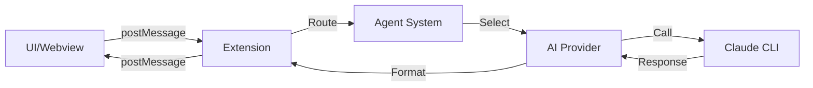

# Multi Agent Chat - Quick Reference Guide

## 🎯 Key Entry Points for Understanding the Code

### Where to Start Reading

1. **`src/extension.ts:activate()`**
   - This is where EVERYTHING starts
   - Follow this to understand initialization

2. **`src/extension.ts:_handleMessage()`**
   - This routes ALL messages from the UI
   - Put a breakpoint here to trace any user action

3. **`src/providers.ts:ClaudeProvider.sendMessage()`**
   - This is where AI calls happen
   - Trace this to understand Claude CLI integration

4. **`src/agents.ts:selectBestAgent()`**
   - This decides which agent handles a request
   - Key to understanding agent routing

## 🔍 Debugging Tips

### Setting Breakpoints

```javascript
// Most useful breakpoints (search for method names):

// 1. See every user message
src/extension.ts  // _handleMessage()

// 2. See agent selection
src/agents.ts     // selectBestAgent()

// 3. See AI provider calls
src/providers.ts  // ClaudeProvider.sendMessage()

// 4. See team coordination
src/providers.ts  // MultiProvider.sendMessage()

// 5. See inter-agent communication
src/agentCommunication.ts  // AgentCommunicationHub.sendMessage()

// 6. See settings changes
src/settings/SettingsManager.ts  // loadSettings()
```

### Console Logging Points

The code already has many `console.log()` statements. View them:
1. Open VS Code Developer Tools: `Help → Toggle Developer Tools`
2. Go to Console tab
3. Filter by "Multi Agent Chat"

### VS Code Debug Configuration

Add to `.vscode/launch.json`:

```json
{
    "version": "0.2.0",
    "configurations": [
        {
            "name": "Run Extension",
            "type": "extensionHost",
            "request": "launch",
            "runtimeExecutable": "${execPath}",
            "args": [
                "--extensionDevelopmentPath=${workspaceFolder}"
            ],
            "outFiles": [
                "${workspaceFolder}/out/**/*.js"
            ],
            "preLaunchTask": "npm: watch"
        }
    ]
}
```

## 🎮 Command Palette Commands

All available commands you can run:

| Command | ID | Keyboard Shortcut |
|---------|-----|-------------------|
| Open Multi Agent Chat | `multiAgentChat.openChat` | `Ctrl+Shift+C` |
| Clear All Conversations | `multiAgentChat.clearAllConversations` | - |
| Initialize Project | `multiAgentChat.initializeProject` | - |
| Migrate Conversations | `multiAgentChat.migrateConversations` | - |
| Show Migration Status | `multiAgentChat.showMigrationStatus` | - |
| **Manage API Keys** (v1.15.1) | `multiAgentChat.manageApiKeys` | - |
| **Open Models Configuration** (v1.15.0) | `multiAgentChat.openModelsConfig` | - |
| **Open Agents Configuration** (v1.15.0) | `multiAgentChat.openAgentsConfig` | - |
| **Reset Models to Defaults** (v1.15.0) | `multiAgentChat.resetModelsConfig` | - |
| **Reset Agents to Defaults** (v1.15.0) | `multiAgentChat.resetAgentsConfig` | - |
| **Update from Defaults** (v1.16.1) | `multiAgentChat.updateFromDefaults` | - |
| **Reload Configurations** (v1.15.0) | `multiAgentChat.reloadConfigurations` | - |

## 📁 Important File Locations

### Configuration Files
- **User Settings**: `~/.config/Code/User/settings.json`
- **Project Settings**: `.machat/config.json`
- **Workspace Settings**: `.vscode/settings.json`
- **Default Models** (v1.15.0): `defaults/models.json` (bundled)
- **Default Agents** (v1.15.0): `defaults/agents.json` (bundled)
- **Default Providers** (v1.16.0): `defaults/providers.json` (bundled)
- **Project Models** (v1.15.0): `.machat/models.json` (optional override)
- **Project Agents** (v1.15.0): `.machat/agents.json` (optional override)
- **Custom Prompts** (v1.15.0): `.machat/agents/agent-prompts/*.md`

### Data Storage
- **Global Conversations**: `~/.config/Code/User/globalStorage/[extension-id]/conversations/`
- **Project Conversations**: `.machat/conversations/`
- **Agent Context**: `.machat/context/project-context.json`
- **API Keys** (v1.15.1): VS Code SecretStorage (encrypted, OS-level)
- **Operation Logs** (Phase 2): VS Code workspaceState

## 🔄 Common Code Paths

### When User Sends a Message

```
1. User types in UI
2. resources/webview/script.js → sendButton.click()
3. vscode.postMessage({type: 'sendMessage', text: ...})
4. extension.ts → _handleMessage() case 'sendMessage'
5. extension.ts → _processMessage()
6. agents.ts → AgentManager.getAgent() (from ConfigurationRegistry v1.15.0)
7. providers.ts → ProviderManager.getProvider()
8. providers/ProviderRegistry.ts → selectProvider() (v1.16.0)
9. Selected provider (Claude CLI / VS Code LM / HTTP)
10. Provider sends message to AI
11. Response received (streamed if enabled)
12. operations/OperationParser.ts → parseOperations() (Phase 2)
13. operations/OperationExecutor.ts → executeOperation() (Phase 2)
14. permissions/PermissionEnforcer.ts → checkPermission() (Phase 2)
15. logging/OperationLogger.ts → logOperation() (Phase 2)
16. extension.ts → webview.postMessage({type: 'agentResponse'})
17. resources/webview/script.js → window.addEventListener('message')
18. UI updated with response
```

### When Team Agent is Used

```
1. User selects Team agent
2. Message sent (steps 1-6 above)
3. providers.ts → MultiProvider returned
4. providers.ts → MultiProvider.sendMessage()
5. Select 3-6 agents based on task (Quick Mode: 3, Full Mode: 6)
6. Parallel queries to each agent via ProviderManager
7. agentCommunication.ts → AgentCommunicationHub broadcasts context
8. Collect all responses
9. Synthesize into unified team response
10. Return combined answer to user
```

## 🛠️ Modifying Common Features

### Add a New Agent (v1.15.0 - JSON-based)

1. Edit `defaults/agents.json` OR `.machat/agents.json`
2. Add new agent definition with id, name, icon, model, etc.
3. Optionally create custom prompt: `.machat/agents/agent-prompts/{agentId}.md`
4. Run `Reload Configurations` command (no restart needed!)

### Add a New Model (v1.15.0 - JSON-based)

1. Edit `defaults/models.json` OR `.machat/models.json`
2. Add model definition under appropriate provider
3. Run `Reload Configurations` command (no restart needed!)

### Add a New Provider (v1.16.0)

1. For OpenAI-compatible: Just edit `defaults/providers.json`
2. For custom format: Create new provider class in `src/providers/`
3. See `docs/guides/ADDING_PROVIDERS.md` for detailed guide

### Change Default Model

1. Edit `defaults/models.json` or `.machat/models.json`
2. Or change in VS Code settings: `multiAgentChat.defaultModel`
3. Or change per-agent in agent JSON config

### Adjust Performance Settings

Edit in VS Code settings:
```json
{
    "multiAgentChat.performance.enableStreaming": true,
    "multiAgentChat.performance.enableCache": true,
    "multiAgentChat.performance.quickTeamMode": false,
    "multiAgentChat.performance.agentTimeout": 12000
}
```

### Modify UI

1. Edit `resources/webview/index.html` for HTML structure
2. Edit `resources/webview/styles.css` for CSS styles
3. Edit `resources/webview/script.js` for UI behavior
4. Restart extension (F5) - no compilation needed for webview files

## 📊 Data Flow Cheat Sheet



## 🔑 Key Variables to Watch

When debugging, watch these variables:

| Variable | Location | What It Shows |
|----------|----------|---------------|
| `this._selectedAgent` | `extension.ts` | Currently selected agent |
| `this._currentConversation` | `extension.ts` | Chat history |
| `message` | `_handleMessage()` | Incoming UI messages |
| `agentConfig` | `providers.ts` | Agent being used |
| `context` | `providers.ts` | Conversation context |
| `activeProcesses` | `providers.ts` | Running Claude CLI processes |

## 🚀 Performance Monitoring

### Check Response Times

Look for these console logs:
```
[Cache HIT] architect                            // Response from cache
[ClaudeProvider] Using direct Claude CLI         // Direct CLI call
[Streaming] architect                            // Streaming response
[Team] Query time: 3421ms                        // Team response time
[AgentCommunicationHub] Broadcasting to 3 agents // Inter-agent communication
```

### Monitor Agent Communication

Open Output panel: `View → Output → Multi-Agent Communication`

## 📝 Testing Checklist

When testing changes:

- [ ] Test single agent response
- [ ] Test team collaboration
- [ ] Test conversation saving/loading
- [ ] Test settings changes
- [ ] Test project vs global storage
- [ ] Test error handling
- [ ] Check performance with cache on/off
- [ ] Verify streaming works
- [ ] Test timeout handling
- [ ] Check memory/context persistence

## 🆘 Common Issues & Solutions

| Issue | Solution | File to Check |
|-------|----------|---------------|
| Extension not loading | Check `package.json` activation events | `package.json` |
| Agent not responding | Verify Claude CLI works (`claude --version`) | `providers.ts` |
| Settings not applying | Check settings hierarchy (workspace > project > global) | `SettingsManager.ts` |
| Conversations not saving | Check `.machat/conversations/` exists | `ConversationManager.ts` |
| Inter-agent comm not working | Check @mention syntax and enableInterCommunication setting | `agentCommunication.ts` |
| UI not updating | Check postMessage calls and webview console | `extension.ts` + `resources/webview/script.js` |

## 💡 Pro Tips

1. **Use F12** (Go to Definition) to jump to any function
2. **Use Shift+F12** (Find All References) to see where something is used
3. **Use Ctrl+Shift+F** to search across all files
4. **Set `"multiAgentChat.outputChannel": true`** to see detailed logs
5. **Use the Output panel** to see inter-agent communication
6. **Check Developer Tools Console** for JavaScript errors in webview

---

Remember: The code flows from `extension.ts` → `agents.ts` → `providers.ts` → Claude → back to UI. Follow this path to understand any feature!